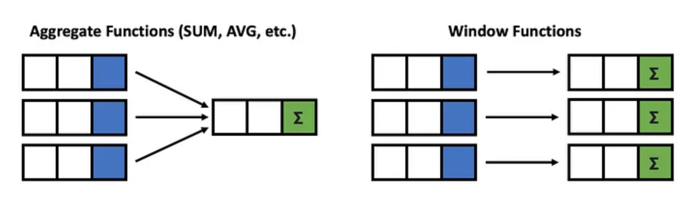
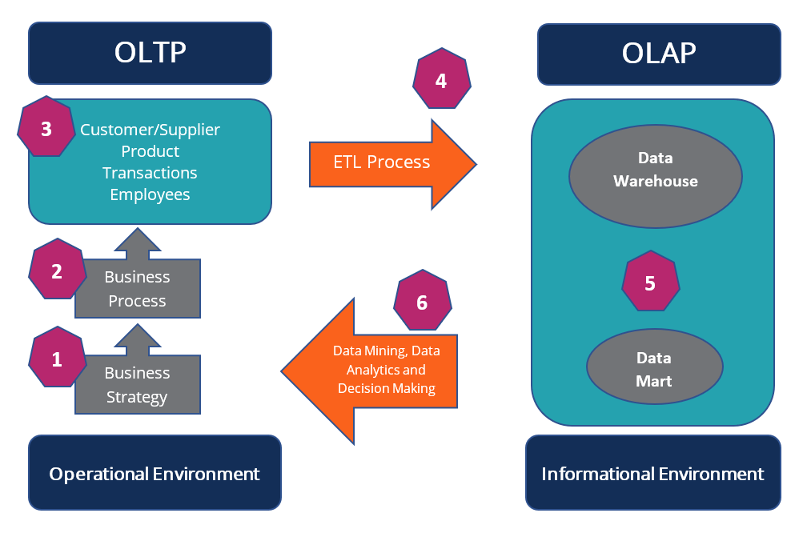

# SQL Interview Questions 

## THEORETICAL
### 1. What is difference between SQL and MySQL ?
SQL is a standard language. SQL is the core of the relational database which is used for accessing and managing database
MySQL is a database management system and RDMS  such as SQL Server.


### 2. What are the different subsets of SQL?
* Data Definition Language (DDL) – It allows you to perform various operations on the database such as CREATE, ALTER, and DELETE objects.
* Data Manipulation Language(DML) – It allows you to access and manipulate data. It helps you to insert, update, delete and retrieve data from the database.
* Data Control Language(DCL) – It allows you to control access to the database. Example – Grant, Revoke access permissions.

### 3. What is a Primary Key ?
A **Primary Key (PK)** in SQL is a column (or collection of columns) or a set of columns that uniquely identifies each row in the table. Null values not allowed.

### 4. What are constraints ?
Constraints in SQL are used to specify the limit on the data type of the table. It can be specified while creating or altering the table statement

Example ;  NOT NULL, CHECK, DEFAULT, UNIQUE, PK, FK

### 5. What is a unique key ?
Uniquely identifies a single row in the table. Multiple values allowed per table. Null values allowed.

### 6. What is Foreign Key ?
**Foreign Key (FK)** maintains referential integrity by enforcing a link between the data in two tables. The foreign key in the child table references the primary key in the parent table.

### 7. What is an Index?
An index refers to a performance tuning method of allowing faster retrieval of records from the table. An index creates an entry for each value and hence it will be faster to retrieve data.

### 8. How many different types of index does SQL have ?
* **Unique**: This index does not allow the field to have duplicate values if the column is unique indexed. If a primary key is defined, a unique index can be applied automatically.
* **Clustered**:  This index reorders the physical order of the table and searches based on the basis of key values. Each table can only have one clustered index.
* **Non – Clustered**: Non-Clustered Index does not alter the physical order of the table and maintains a logical order of the data. Each table can have many nonclustered indexes.

### 9. What is the difference between clustered and non-clustered index in SQL ?

* Clustered index is used for easy retrieval of data from the database and its faster whereas reading from non clustered index is relatively slower.
* One table can only have one clustered index whereas it can have many non clustered index.

### 10. What is difference between DROP and TRUNCATE ?
DROP command removes a table and it cannot be rolled back from the database whereas TRUNCATE command removes all the rows from the table.

### 11. What is the main difference between ‘BETWEEN’ and ‘IN’ condition operators ?
BETWEEN operator is used to display rows based on a range of values in a row whereas the IN condition operator is used to check for values contained in a specific set of values.

### 12. What is the difference between DELETE and TRUNCATE statements ?
* **Delete** command is used to delete a row in a table. You can rollback data after using delete statement. It is a DML command. It is slower than Truncate
* **Truncate** is used to delete all the rows from a table. You cannot rollback data. It is a DDL command. It is faster than Delete

### 13. What is the difference between CHAR and VARCHAR2 datatype in SQL ?

* Char is a data type in SQL that can store characters of a *fixed length*. 
* Varchar is a datatype in SQL that holds characters of variable length. It uses dynamic memory location.

### 14. What are Entities and Relationships ?

**Entities**: A person, place, or thing in the real world about which data can be stored in a database. 

**Relationships**: Relation or links between entities that have something to do with each other.

### 15. What is the ACID property in a database ?

**Atomicity**: Atomicity refers to the transactions that are completely done or failed where transaction refers to a single logical operation of a data. It means if one part of any transaction fails, the entire transaction fails and the database state is left unchanged.

**Consistency**: Consistency ensures that the data must meet all the validation rules. In simple words,  you can say that your transaction never leaves the database without completing its state.

**Isolation**: The main goal of isolation is concurrency control.

**Durability**: Durability means that if a transaction has been committed, it will occur whatever may come in between such as power loss, crash or any sort of error.

### 16. Are NULL values same as that of zero or a blank space ?
 
 A NULL value is not at all same as that of zero or a blank space. NULL value represents a value which is unavailable, unknown, assigned or not applicable whereas a zero is a number and blank space is a character.

### 17. What is **CLAUSE** in SQL ?

SQL clause helps to limit the result set by providing a condition to the query. A clause helps to filter the rows from the entire set of records.

### 18. What is the difference between ‘HAVING’ clause and a ‘WHERE’ clause ?

HAVING clause can be used only with SELECT statement. It is usually used in a GROUP BY clause and whenever GROUP BY is not used, HAVING behaves like a WHERE clause.

Having Clause is only used with the GROUP BY function in a query whereas WHERE Clause is applied to each row before they are a part of the GROUP BY function in a query.

### 19. What is a Stored Procedure in SQL ?

A Stored Procedure is a function which consists of many SQL statements to access the database system. Several SQL statements are consolidated into a stored procedure and execute them whenever and wherever required which saves time and avoid writing code again and again.

**Pros**: can be used as a modular programming which means create once, store and call for several times whenever it is required. This supports faster execution. It also reduces network traffic and provides better security to the data.

**Cons**: The only disadvantage of Stored Procedure is that it can be executed only in the database and utilizes more memory in the database server.

Following stored procedure called sp_GetProductDetails which accepts a parameter called @ProductId of type INT. 
The stored procedure selects the details of the product from the Products table where the ProductId matches the value of @ProductId.
```
CREATE PROCEDURE sp_GetProductDetails
    @ProductId INT
AS
BEGIN
    SELECT ProductId, ProductName, Price
    FROM Products
    WHERE ProductId = @ProductId
END
```
You can then execute this stored procedure by passing a value for the @ProductId parameter:
```
EXEC sp_GetProductDetails @ProductId = 1;
```

### 20. What are joins in SQL ?

In SQL , a join is used to combine rows from two or more tables based on a related column between them. Joins are used to retrieve data that is spread across multiple tables in a database.

There are several types of joins in SQL, including:

* INNER JOIN / JOIN: Returns only the rows that have matching values in both tables.
* LEFT JOIN: Returns all the rows from the left table and the matched rows from the right table. If there is no match in the right table, NULL values are returned for those columns.
* RIGHT JOIN: Returns all the rows from the right table and the matched rows from the left table. If there is no match in the left table, NULL values are returned for those columns.
* OUTER JOIN / FULL OUTER JOIN: Returns all the rows from both tables, with NULL values for the columns that do not have a match in the other table.


```
-- INNER JOIN or just JOIN retrieves all users and likes that match each other 
-- ( where the id field in users matches a user_id in the likes table and vice versa )
SELECT users.name, likes.like FROM users JOIN likes ON users.id = likes.user_id;

-- LEFT JOIN retrieves all users and its likes if there is any else sets NULL in the like field
SELECT users.name, likes.like FROM users LEFT JOIN likes ON users.id = likes.user_id;

-- RIGHT JOIN is like LEFT JOIN but retrieves all likes with all matching users or NULL if it doesn't have any matching user
SELECT users.name, likes.like FROM users RIGHT JOIN likes ON users.id = likes.user_id;

-- OUTER JOIN or OUTER LEFT and RIGHT with UNION (MySQL don't support FULL OUTER JOIN) retrieves all users and likes and matches them 
-- and sets NULL on any like without any match on user  and same thing with user with no matching like
SELECT users.name, likes.like FROM users LEFT OUTER JOIN likes ON users.id = likes.user_id
UNION
SELECT users.name, likes.like FROM users RIGHT OUTER JOIN likes ON users.id = likes.user_id
```

### 21. What is data integrity ? 

Data integrity in SQL refers to the *accuracy*, *consistency*, and *reliability* of data stored in a database. It ensures that the data is complete, correct, and valid. In other words, data integrity ensures that the data is of high quality and can be relied upon for decision-making, analysis, and reporting.

There are different types of data integrity in SQL:

* Entity integrity: It ensures that each row in a table has a unique identifier, such as a primary key.
* Referential integrity: It ensures that the relationships between tables are maintained, and any foreign key values in one table refer to valid primary key values in another table.
* Domain integrity: It ensures that the data in each column of a table conforms to a specific set of rules, such as data type, range, and format.
* User-defined integrity: It allows users to define their own rules and constraints to ensure the accuracy and consistency of data.
* Overall, data integrity is critical for maintaining the reliability and consistency of data in a SQL database, and it helps to prevent errors, data loss, and data corruption.

### 22. What is view in SQL ?

*View* is a virtual table that is based on the result of a SELECT query. It is not a physical table, but rather a stored SELECT statement that can be used to retrieve data in a specific format.

A view is created using the CREATE VIEW statement, which defines the SELECT query used to generate the view's data. The result set of the SELECT query is then stored as a named object that can be used in other SQL statements just like a regular table.

Views are useful for several reasons:

1. They provide a simplified view of complex data. A view can be used to hide the complexity of a database schema and present a simpler view of the data that is more easily understood by users.
2. They provide a way to control access to data. Views can be used to restrict access to certain columns or rows of data, so that users only see the data they need to see.
3. They provide a way to aggregate data. Views can be used to group data together and calculate summary information, such as totals or averages, which can be used for reporting or analysis.
4. They provide a way to combine data from multiple tables. Views can be used to combine data from several tables into a single view, making it easier to work with the data.
5. Overall, views are a powerful tool in SQL that can help to simplify complex data, control access to data, and provide a flexible way to work with data from multiple tables.


### 23. What are the different types of a subquery ?

**Subquery** is a query that is nested within another query. The subquery is used to retrieve data that will be used by the outer query to filter or manipulate the results.

There are two types of subqueries:

* Single-row subquery: A single-row subquery is a subquery that returns only one row of data, which is then used by the outer query as a value in a comparison or calculation. For example, a single-row subquery can be used to find the maximum value in a column and then use that value to filter the results of the outer query.
* Multiple-row subquery: A multiple-row subquery is a subquery that returns multiple rows of data, which are then used by the outer query to filter or manipulate the results. For example, a multiple-row subquery can be used to find all the customers who have ordered a particular product and then use that information to generate a report.

```
-- Single-row subquery
SELECT *
FROM products
WHERE price = (SELECT MAX(price) FROM products);

-- Multiple-row subquery
SELECT *
FROM customers
WHERE customer_id IN (SELECT customer_id FROM orders WHERE product_id = 123);
```

Subqueries can also be classified by where they are used in a SQL statement. There are three types of subqueries based on where they are used:

* Subquery in SELECT statement: A subquery can be used in the SELECT statement to retrieve data from another table or to perform a calculation using data from another table.

* Subquery in FROM clause: A subquery can be used in the FROM clause to create a temporary table that is used by the outer query to retrieve data.

* Subquery in WHERE clause: A subquery can be used in the WHERE clause to filter the results of the outer query based on a condition that involves data from another table.

```
-- Subquery in SELECT statement
SELECT product_name, (SELECT MAX(price) FROM products) AS max_price
FROM products;

-- Subquery in FROM clause
SELECT *
FROM (SELECT customer_id, SUM(total) as total_spent FROM orders GROUP BY customer_id) AS customer_totals
WHERE total_spent > 1000;

-- Subquery in WHERE clause 
SELECT *
FROM products
WHERE category_id = (SELECT category_id FROM categories WHERE category_name = 'Electronics');
```

### 24. What is collation in SQL ?

Collation in SQL refers to the rules used to compare and sort character data, which can affect the results of SQL queries that involve character data. It determines how characters are treated in terms of case sensitivity, accent marks, and other language-specific rules. SQL supports a wide variety of collations, and each database has a default collation that is used for all character data in the database.

### 25. What is trigger in SQL ?

*Trigger* is a type of stored procedure that is automatically executed in response to certain database events, such as insert, update, or delete operations on a table.
Triggers are commonly used in database applications to enforce data consistency and integrity, or to automate tasks that need to be performed whenever data changes. However, because triggers can have a significant impact on database performance, they should be used judiciously and only when necessary.


Here is an example of a trigger in SQL:
```
CREATE TRIGGER update_customer_orders
AFTER INSERT ON orders
FOR EACH ROW
BEGIN
  UPDATE customer_orders
  SET total_order_amount = total_order_amount + NEW.total_amount
  WHERE customer_id = NEW.customer_id;
END;
```
This trigger will be executed automatically after a new row is inserted into the "orders" table. The 'NEW' keyword is used to refer to the new row being inserted, and the trigger will update the "customer_orders" table to add the total amount of the new order to the corresponding customer's total order amount.

### 26. What is table and field in SQL ?

A table refers to a collection of data in an organised manner in form of rows and columns. A field refers to the number of columns in a table. 

For example:

* table: Students
* field: id, full_name, marks, register_date, origin

### 27. What are the different operators available in SQL ?

SQL has several types of operators that can be used to perform various tasks on data in a database. The following are some of the most common SQL operators:

1. Arithmetic Operators: SQL supports the basic arithmetic operators: + (addition), - (subtraction), * (multiplication), / (division), and % (modulus).
2. Comparison Operators: SQL supports various comparison operators, including = (equal to), != or <> (not equal to), > (greater than), < (less than), >= (greater than or equal to), and <= (less than or equal to).
3. Logical Operators: SQL supports three logical operators: AND, OR, and NOT. These operators are used to combine two or more conditions in a WHERE clause.
4. String Operators: SQL supports the concatenation operator (||) to concatenate two or more strings, and the LIKE operator to search for a string pattern within a string.
5. NULL Operators: SQL has the special operator IS NULL which is used to check if a value is NULL or not.
6. Set Operators: SQL supports set operators such as UNION, UNION ALL, INTERSECT, and EXCEPT which can be used to combine results of multiple SELECT statements.

### 28. What is the difference between cross join and natural join ?

**Cross Join**: A cross join (also known as a Cartesian join) returns the Cartesian product of the two tables involved. In other words, *it returns all possible combinations of rows from both tables*. This type of join does not use any join condition to filter rows.
```
SELECT * FROM table1 CROSS JOIN table2;
```
**Natural Join**: A natural join *returns only the rows that have matching values in both tables*, based on the column names that are the same in both tables. It automatically matches columns with the same name in both tables and returns only those rows where the values in those columns match. This type of join does not require a join condition to be specified explicitly.
```
SELECT * FROM table1 NATURAL JOIN table2;
```
In summary, the main difference between a cross join and a natural join is that a cross join returns all possible combinations of rows from both tables, while a natural join returns only the rows that have matching values in both tables based on the column names that are the same in both tables.

### 29. What is query optimization in SQL ?

Query optimization is the process of improving the performance of a database query by selecting the most efficient method of executing it. The goal of query optimization is to minimize the response time of a query and reduce the amount of system resources needed to execute it.

Query optimization involves several steps, including:

1. **Parsing and Translation**:
The first step in query optimization is to parse and translate the query into a form that can be processed by the database engine. This involves breaking the query down into its component parts, such as the SELECT, FROM, and WHERE clauses, and generating an execution plan.

2. **Cost Estimation**:
The next step is to estimate the cost of executing the query using different execution plans. This involves analyzing the size of the data, the complexity of the query, and the resources required to execute it.

3. **Plan Generation**:
Based on the cost estimates, the database engine generates multiple execution plans for the query. Each plan represents a different way of executing the query, and may involve different optimization techniques such as index selection, join ordering, and filtering.

4. **Plan Selection**:
The final step is to select the best execution plan based on the estimated cost. The selected plan is then executed to retrieve the query results.

Query optimization is critical for improving the performance of database systems, especially for large, complex queries that involve multiple tables and join operations. By optimizing queries, database administrators can improve the overall efficiency of the system, reduce response times, and ensure that users can retrieve the information they need in a timely manner.

### 30. What is Normalization and what are the advantages of it ?
Normalization is a process of organizing data in a database to reduce redundancy and dependency. It involves dividing a larger table into smaller tables and defining relationships between them to ensure that each table contains only related data.

There are several levels of normalization, with each level representing a higher degree of organization and a lower level of redundancy. The most commonly used levels of normalization are:

* First Normal Form (1NF): This level ensures that each column in a table contains only atomic values (values that cannot be divided further), and that each row in the table is unique.
* Second Normal Form (2NF): This level ensures that each non-key column in a table is fully dependent on the primary key, and that there are no partial dependencies (where a non-key column depends on only part of the primary key).
* Third Normal Form (3NF): This level ensures that each non-key column in a table is dependent only on the primary key, and that there are no transitive dependencies (where a non-key column depends on another non-key column).

The advantages of normalization include:

* Reduced Redundancy: Normalization helps to reduce data redundancy by eliminating duplicate data and storing it only once. This reduces the storage requirements and helps to improve the performance of the database.
* Improved Data Integrity: Normalization helps to improve data integrity by ensuring that each piece of data is stored in only one place. This reduces the likelihood of data inconsistencies and improves the accuracy of the data.
* Improved Query Performance: Normalization can help to improve query performance by breaking down large tables into smaller, more manageable tables. This allows queries to be executed more efficiently, reducing response times and improving overall performance.
* Easier Maintenance: Normalization makes it easier to maintain the database by simplifying data structures and reducing the complexity of the data model. This makes it easier to modify and update the database as needed.

### 31. What are the database design basics ?
A properly designed database provides you with access to up-to-date, accurate information

A good database design is, therefore, one that:

* Divides your information into subject-based tables to reduce redundant data.
* Provides Access with the information it requires to join the information in the tables together as needed.
* Helps support and ensure the accuracy and integrity of your information.
* Accommodates your data processing and reporting needs.

The design process consists of the following steps:

**Define the Purpose and Scope of the Database**: Before you start designing a database, you need to determine its purpose and scope. What is the database going to be used for? Who is going to use it? What data will it store? What queries will it need to support? These questions will help you determine the requirements of your database.

**Identify the Entities and Relationships**: The next step is to identify the entities and relationships that will be represented in the database. An entity is anything that can be represented in the database, such as a person, place, or thing. Relationships define how entities are related to one another.

**Create a Data Model**: Once you have identified the entities and relationships, you can create a data model that represents them in a graphical format. There are several types of data models, including entity-relationship (ER) models, UML diagrams, and data flow diagrams.

**Normalize the Data**: Normalization is the process of organizing the data in a database so that it is consistent and efficient. This involves breaking down larger tables into smaller ones and eliminating redundant data.

**Define the Data Types and Constraints**: After normalizing the data, you need to define the data types and constraints for each field in the database. This includes specifying the data type (e.g., string, integer, date) and any constraints on that data (e.g., length limits, required fields, unique values).

**Create the Tables and Relationships**: Using the data model and data types, you can now create the tables and relationships in the database. Tables represent the entities, and relationships define how they are related to one another.

**Populate the Database**: Once the tables are created, you can populate the database with data. This can be done manually or through an automated process, depending on the size of the database.

**Test the Database**: After populating the database, you need to test it to make sure it functions correctly. This includes running queries, updating data, and verifying that the database performs as expected.

Cornerstones to take into consideration:

1. Data Integrity - Ensuring the accuracy and consistency of the data.
2. Scalability - Ensuring the database can handle increasing amounts of data and users.
3. Security - Protecting the database from unauthorized access and ensuring data privacy.
4. Performance - Ensuring the database operates efficiently and responds quickly to user requests.
5. Maintainability - Ensuring the database is easy to maintain and update over time.
6. Usability - Ensuring the database is easy to use and navigate for end-users.
7. Flexibility - Ensuring the database can adapt to changing business needs and requirements.

### 32. What is aggregate functions in MySQL ?
An aggregate function is a function in SQL that performs a calculation on a set of values and returns a single value as the result. 
The set of values is typically a group of rows in a table, and the function is applied to one or more columns in the table

**List of aggregate functions in MySQL**

|   **FUNCTION**   |                  **DESCRIPTION**                 |
|:----------------:|:------------------------------------------------:|
|       AVG()      | Return the average value of the argument         |
|     BIT_AND()    | Return bitwise AND                               |
|     BIT_OR()     | Return bitwise OR                                |
|     BIT_XOR()    | Return bitwise XOR                               |
|      COUNT()     | Return a count of the number of rows returned    |
|  COUNT(DISTINCT) | Return the count of a number of different values |
|  GROUP_CONCAT()  | Return a concatenated string                     |
|  JSON_ARRAYAGG() | Return result set as a single JSON array         |
| JSON_OBJECTAGG() | Return result set as a single JSON object        |
|       MAX()      | Return the maximum value                         |
|       MIN()      | Return the minimum value                         |
|       STD()      | Return the population standard deviation         |
|     STDDEV()     | Return the population standard deviation         |
|   STDDEV_POP()   | Return the population standard deviation         |
|   STDDEV_SAMP()  | Return the sample standard deviation             |
|       SUM()      | Return the sum                                   |
|     VAR_POP()    | Return the population standard variance          |
|    VAR_SAMP()    | Return the sample variance                       |
|    VARIANCE()    | Return the population standard variance          |

Here are some examples of aggregate functions in SQL:
```
-- Calculate the average salary of all employees
SELECT AVG(salary) FROM employees;

-- Calculate the total number of items in a store
SELECT COUNT(*) FROM inventory;

-- Count the number of distinct product categories in a store
SELECT COUNT(DISTINCT category) FROM products;

-- Concatenate the names of all employees in a department
SELECT GROUP_CONCAT(name SEPARATOR ', ') FROM employees WHERE department='Sales';

-- Return the highest and lowest salary among all employees
SELECT MAX(salary) as highest FROM employees;
SELECT MIN(salary) as lowest FROM employees;

-- Calculate the sum of all sales in a store
SELECT SUM(sales) FROM store;

-- Calculate the population standard deviation of product prices
SELECT STDDEV_POP(price) FROM products;

-- Calculate the sample variance of customer ages
SELECT VAR_SAMP(age) FROM customers;
```

### 33. What is difference between **UNION** and **UNION ALL** in SQL ?

UNION merges the contents of two structurally-compatible tables into a single combined table. The difference between UNION and UNION ALL is that UNION will omit duplicate records whereas UNION ALL will include duplicate records.
The performance of UNION ALL will typically be better than UNION, since UNION requires the server to do the additional work of removing any duplicates

### 34. What is database ?
A database is an organized collection of structured data that can be stored, easily accessed, managed, and retrieved digitally from a remote or local computer system.

### 35. What is denormalization ?
Denormalization is the opposite of normalization; redundant data is added to speed up complex queries that have multiple tables that need to be joined. Optimization of the read performance of a database is attempted by adding or grouping redundant copies of data.

### 36. What is data warehouse ?
A data warehouse is a large store of accumulated data, from a wide range of sources, within an organization. The data helps drive business decisions.

### 37. What is difference between views and tables ?

|                                      **Views**                                     |                                               **Tables**                                              |
|:----------------------------------------------------------------------------------:|:-----------------------------------------------------------------------------------------------------:|
| A view is a virtual table that is extracted from a database                        | A table is structured with a set number of columns and a boundless number of rows                     |
| A view does not hold data itself                                                   | A table contains data and stores it in databases                                                      |
| A view is utilized to query certain information contained in a few distinct tables | A table holds fundamental client information and cases of a characterized object                      |
| In a view, we will get frequently queried information                              | In a table, changing the information in the database changes the information that appears in the view |

### 38. What is SQL Window functions ?
SQL window functions are a type of SQL function that allow you to perform calculations across a set of rows that are related to the current row. They are commonly used in analytic queries to calculate rankings, cumulative sums, moving averages, and other types of aggregations.

Window functions are similar to the aggregation done in the GROUP BY clause. However, rows are not grouped into a single row, each row retains their separate identity.


Window functions in SQL offer more flexibility, increased query efficiency, simplified code, and improved accuracy in data analysis, making them a powerful tool for performing complex calculations and analysis on your data within a single SQL query.

Here is a list of some common window functions in SQL, along with examples:

**ROW_NUMBER()**: assigns a unique integer value to each row in the result set.
```
SELECT ROW_NUMBER() OVER() AS row_num, name, age
FROM customers;
```
**RANK()**: assigns a rank to each row based on its value relative to the other rows.
```
SELECT RANK() OVER(ORDER BY salary DESC) AS rank, name, salary
FROM employees;
```
**DENSE_RANK()**: assigns a rank to each row based on its value relative to the other rows, but without any gaps in the ranking.
```
SELECT DENSE_RANK() OVER(ORDER BY score DESC) AS dense_rank, name, score
FROM students;
```
**SUM()**, **AVG()**, **MIN()**, **MAX()**: calculate an aggregate value across the rows in the window.
```
SELECT department, AVG(salary) OVER(PARTITION BY department) AS avg_salary
FROM employees;
```
**LAG()** and **LEAD()**: retrieve the value from a previous or subsequent row in the window.
```
SELECT name, score, LAG(score, 1) OVER(ORDER BY score DESC) AS prev_score,
LEAD(score, 1) OVER(ORDER BY score DESC) AS next_score
FROM students;
```
**NTILE()**: divides the result set into a specified number of groups, assigning a group number to each row.
```
SELECT NTILE(4) OVER(ORDER BY salary DESC) AS quartile, name, salary
FROM employees;
```
**FIRST_VALUE()** and **LAST_VALUE()**: retrieve the first or last value in the window.
```
SELECT name, score, FIRST_VALUE(score) OVER(ORDER BY score DESC) AS highest_score,
LAST_VALUE(score) OVER(ORDER BY score DESC) AS lowest_score
FROM students;
```

### 39. What is order of operations in SQL ?
The order of operations in SQL, also known as operator precedence, determines the order in which the different operators and functions in a SQL statement are evaluated. The order of operations is important in ensuring that the SQL statement is evaluated correctly and produces the intended results.

The following is the order of operations in SQL, from highest to lowest precedence:

1. Parentheses: Expressions enclosed in parentheses are evaluated first.
2. Unary operators: Unary operators such as NOT, +, and - are evaluated next.
3. Multiplication, Division, and Modulus: These arithmetic operators are evaluated next, from left to right.
4. Addition and Subtraction: These arithmetic operators are evaluated next, from left to right.
5. Comparison operators: Comparison operators such as =, <>, <, <=, >, and >= are evaluated next.
6. Logical operators: Logical operators such as AND, OR, and NOT are evaluated next.
7. BETWEEN, IN, LIKE, and EXISTS: These operators are evaluated next.
8. CASE expressions: CASE expressions are evaluated next.
9. Aggregate functions: Aggregate functions such as COUNT, SUM, AVG, MAX, and MIN are evaluated next.
10. Window functions: Window functions are evaluated next.
11. DISTINCT, GROUP BY, and HAVING: These operators are evaluated next.
12. SELECT: The SELECT statement is evaluated last.

### 40. How many type of key does SQL have ?

**Primary Key**: A primary key is a unique identifier for each record in a table. It is used to ensure that each record can be identified uniquely, and it is often used as the basis for relationships with other tables.

**Foreign Key**: A foreign key is a field in a table that refers to the primary key of another table. It is used to establish a relationship between two tables, and it ensures that data in one table can be linked to data in another table.

**Candidate Key**: A candidate key is a field or combination of fields that can be used as a primary key for a table. It is an alternative key that can be used instead of the primary key.

**Composite Key**: A composite key is a primary key that consists of two or more fields. It is used when no single field can uniquely identify a record in a table.

**Unique Key**: A unique key is a field or combination of fields that ensures that each record in a table is unique. It is similar to a primary key, but it does not have to be used as the basis for relationships with other tables.

Overall, keys are used to ensure data integrity and to establish relationships between tables in a database. They are a fundamental concept in SQL and are essential for managing and manipulating data effectively.

### 41. What is DBMS ?
DBMS stands for Database Management System. It is a software system that allows users to create, manage, and manipulate databases. A database is a collection of data that is organized and stored in a way that allows users to easily retrieve and update it.

A DBMS provides a framework for creating, storing, and managing data in a structured format. It provides users with an interface to interact with the database and perform tasks such as adding, modifying, deleting, and retrieving data.

Some popular examples of DBMS include MySQL, Oracle, Microsoft SQL Server, and MongoDB.

### 42. What is scalar functions in SQL ?
Scalar functions in SQL are functions that take one or more input parameters and return a single value as the result. These functions operate on individual rows and can be used in SELECT statements, WHERE clauses, and other parts of SQL queries where a single value is expected.

There are various types of scalar functions available in SQL, including:

1. String functions: These functions perform operations on strings, such as concatenation, conversion, and searching.
2. Date and time functions: These functions perform operations on dates and times, such as calculating the difference between two dates or adding a certain number of days to a date.
3. Numeric functions: These functions perform operations on numeric values, such as rounding, truncation, and conversion.
4. Conversion functions: These functions convert one data type to another, such as converting a string to a number or a date to a string.
Examples of scalar functions in SQL include:

* LEN(): Returns the length of a string.
* DATEADD(): Adds a specified time interval to a date.
* ROUND(): Rounds a numeric value to a specified precision.
* CAST(): Converts a value from one data type to another.

Scalar functions can be very useful in SQL queries, as they allow you to perform various calculations and manipulations on data without the need for complex programming logic.

### 43. What is OLTP ?
OLTP stands for Online Transaction Processing, which is a type of computer system that manages and processes transaction-oriented applications, such as financial transactions, order processing, and inventory management. OLTP systems are designed to handle high volumes of small transactions in real-time or near real-time, typically with short response times.

OLTP databases typically use normalized data structures to ensure data integrity, with tables organized around entities and relationships. These systems are optimized for data reads and writes, and are usually built on relational database management systems (RDBMS) like Oracle, SQL Server, or MySQL.

OLTP systems are commonly used in businesses and organizations that need to process a high volume of transactions quickly and efficiently, such as banks, airlines, and e-commerce websites.

### 44. What is OLAP ?
OLAP stands for Online Analytical Processing, which is a computer-based approach to analyzing data that allows users to access and analyze large sets of data from multiple perspectives. OLAP systems are designed for complex data analysis, and are optimized for querying and reporting.

OLAP databases typically use denormalized data structures to provide fast and flexible access to data. OLAP systems allow users to query data using dimensions, measures, and hierarchies to analyze data across different dimensions, such as time, geography, and product lines.

OLAP systems are commonly used in business intelligence and data analysis applications, where users need to quickly analyze large amounts of data to identify trends, patterns, and insights. They are typically built on multidimensional database management systems (MDBMS) like Microsoft Analysis Services, Oracle Essbase, or SAP BusinessObjects.



### 45. What is difference between OLAP and OLTP ?
OLTP (Online Transaction Processing) and OLAP (Online Analytical Processing) are two different types of computer-based systems designed to serve different purposes:

**Purpose**: OLTP is designed to manage and process transaction-oriented applications in real-time or near real-time, while OLAP is designed for complex data analysis and querying.

**Data Structure**: OLTP databases typically use normalized data structures to ensure data integrity, while OLAP databases typically use denormalized data structures to provide fast and flexible access to data.

**Usage**: OLTP systems are optimized for data reads and writes, and are usually built on relational database management systems (RDBMS) like Oracle or SQL Server. OLAP systems are optimized for querying and reporting, and are typically built on multidimensional database management systems (MDBMS) like Microsoft Analysis Services or Oracle Essbase.

**Queries**: OLTP systems typically involve simple queries, such as retrieving a single record, while OLAP systems involve complex queries that analyze data across multiple dimensions.

**Users**: OLTP systems are designed for transactional users, such as bank tellers or customer service representatives, while OLAP systems are designed for analytical users, such as business analysts or data scientists.

In summary, OLTP systems are designed for transaction processing and OLAP systems are designed for data analysis and querying.
## CODING

### 1. How to insert NULL values in a column while inserting the data?
To insert a NULL value into a column while inserting data into a table, you can use the keyword NULL in place of the actual value.

For example, consider a table named "employees" with columns "employee_id", "first_name", "last_name", and "email". If you want to insert a NULL value into the email column, you can do it as follows:
```
INSERT INTO employees (employee_id, first_name, last_name, email) 
VALUES (1, 'John', 'Doe', NULL);
```
Another way to insert a NULL value into a column is to omit it from the column list in the INSERT statement. If you omit a column from the list, the database will insert a NULL value into the column by default.
```
INSERT INTO employees (employee_id, first_name, last_name) 
VALUES (1, 'John', 'Doe');
```

### 2. How can you select unique records from a table ?
To select unique records from a table, you can use the DISTINCT keyword in a SELECT statement. The DISTINCT keyword filters out duplicate values and returns only the unique values in the specified column or columns.

For example, consider a table named "employees" with columns "employee_id", "first_name", "last_name", and "department". To select only the unique department names from the table, you can use the following query:
```
SELECT DISTINCT department FROM employees;
```
If you want to select unique records based on multiple columns, you can specify those columns in the SELECT statement, like this:
```
SELECT DISTINCT column1, column2, column3 FROM table_name;
```
**NOTE**: It's worth noting that using the DISTINCT keyword can have performance implications, especially on large tables. If you're working with a large dataset, you may want to consider other techniques such as grouping and aggregation to identify unique records.


### 3. Regular Expression Querry
Write a query the list of CITY names starting with vowels (i.e., a, e, i, o, or u) from STATION. Your result cannot contain duplicates.
```
-- option 1
SELECT DISTINCT CITY
FROM STATION
WHERE CITY REGEXP '^[aeiouAEIOU]';

-- option 2
SELECT DISTINCT CITY
FROM STATION
WHERE SUBSTR(CITY, 1, 1) IN ('a', 'e', 'i', 'o', 'u', 'A', 'E', 'I', 'O', 'U');
```

### 4. Removing Duplicate Values 
Write a query that remove duplicate values from table
```
-- prepare environment
CREATE DATABASE family_db;

USE family_db;

CREATE TABLE family (
   id INT PRIMARY KEY AUTO_INCREMENT,
   name VARCHAR(50) NOT NULL,
   age INT NOT NULL,
   gender ENUM('male', 'female') NOT NULL,
   relationship VARCHAR(20) NOT NULL
);

INSERT INTO family (name, age, gender, relationship)
VALUES
   ('John Smith', 45, 'male', 'father'),
   ('Jane Smith', 42, 'female', 'mother'),
   ('Bob Smith', 18, 'male', 'brother'),
   ('Sally Smith', 15, 'female', 'sister'),
   ('Tom Johnson', 55, 'male', 'grandfather'),
   ('Mary Johnson', 50, 'female', 'grandmother'),
   ('Jim Johnson', 28, 'male', 'uncle'),
   ('Karen Johnson', 25, 'female', 'aunt'),
   ('Mark Davis', 30, 'male', 'cousin'),
   ('Sarah Davis', 28, 'female', 'cousin');
```
Following code uses a self-join on the "family" table to compare each row with all other rows in the table, looking for duplicates based on the values of the name, age, gender, and relationship columns. The WHERE clause filters the results to only include rows where the ID of the first row is greater than the ID of the second row (to avoid deleting the original row), and where all other column values are identical. The DELETE statement then removes the duplicate row from the table.
```
-- OPTION 1 (self-join)

DELETE f1
FROM family f1, family f2
WHERE f1.id > f2.id
AND f1.name = f2.name
AND f1.age = f2.age
AND f1.gender = f2.gender
AND f1.relationship = f2.relationship;
```
Instead of using a self-join, which can be slow for large tables, you can use a temporary table to store the distinct rows, and then replace the original table with the temporary table.
```
-- OPTION 2 (temp table and distinct)

-- Create a new temporary table with the same schema as the original table
CREATE TEMPORARY TABLE tmp_family LIKE family;
-- Insert the distinct rows from the original table into the temporary table
INSERT INTO tmp_family
SELECT DISTINCT * FROM family;
-- Drop the original table:
DROP TABLE family;
-- Rename the temporary table to the original table name
RENAME TABLE tmp_family TO family;
```
This approach is faster and more efficient than using a self-join, as it only scans the original table once, and it avoids the overhead of deleting rows one by one. However, it may require more disk space to create the temporary table, so make sure you have enough free space on your server before running this code.

### 5. What is the output of following statements and why ?
```
-- 1st statement
select '123ABC' * 3;
-- 2nd statement
select 'ABC123' * 3;
```
To make the multiplication with 3 MySQL automatically converts the string 123 into a number.But conversion to a number starts from left to right. If the conversion is not possible the result is 0

Result of **select '123ABC' * 3;** is 369 but result of **select 'ABC123' * 3;** is 0
