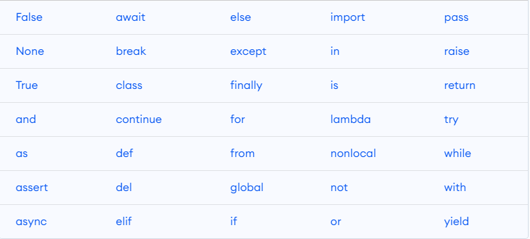

# Python Theoretical Questions

Theoretical interview questions in Python are designed to assess a candidate's understanding of fundamental concepts and principles in the field of software development. 

### 1. What are key features of Python ?

* Easy to learn due to clear syntax and readability	
* Easy to interpret, making debug is easy
* Free and open source
* OOP supported, general purpose programming language
* Python is **dynamically typed**, this means that you don’t need to state the types of variables when you declare them or anything like that.

### 2. What are keywords in Python ?

Keywords are the reserved words in Python. We cannot use a keyword as a variable name, function name or any other identifier.
Here's a list of all keywords in Python Programming



### 3. What are literals in Python ?

Literals in Python refer to the data that is given in a variable or constant. 

* String Literals
* Numeric Literals
* Boolean Literals
* Special Literals

### 4. What are functions in Python ?
Functions in Python refer to blocks that have organised, and reusable codes to perform single, and related events. Functions are important to create better modularity for applications which reuse high degree of coding. Functions are executed only when a call is made to the function.

### 5. What is the difference between list and tuples in Python ?

| **LIST**                          | **TUPLE**                             |
|-------------------------------	|------------------------------------	|
| Mutable. Items can be changed 	| Immutable. Items cannot be changed 	|
| Slower than tuples            	| Faster than list                   	|
| eg_list= [1,2,3,4,5]          	| example=(1,2,3,4,5)                	|

### 6. What are Python namespaces ?
A namespace is a naming system used to make sure that names are unique to avoid naming conflicts.The objects are variables and functions. 

* Built-in namespace– These namespaces contain all the built in objects in python and are available whenever python is running.
* Global namespace– These are namespaces for all the objects created at the level of the main program.
* Enclosing namespaces– These namespaces are at the higher level or outer function.
* Local namespaces– These namespaces are at the local or inner function.

### 7. What are decorators in Python ? 
Decorators in Python are essentially functions that add functionality to an existing function in Python without changing the structure of the function itself. Decorators are used to add some design patterns to a function without changing its structure. 

Decorators generally are defined before the function they are enhancing. To apply a decorator we first define the decorator function. Then we write the function it is applied to and simply add the decorator function above the function it has to be applied to. For this, we use the **@ symbol** before the decorator.

```
def whee_decorator(func):
    def wrapper():
        print("Something is happening before the function is called.")
        func()
        print("Something is happening after the function is called.")
    return wrapper

@whee_decorator
def say_whee():
    print("Whee!")
```

### 8. What is slicing in Python ?
Slicing is used to access parts of sequences like lists, tuples, and strings.

The syntax of slicing is  `[start:stop:step]`

* **start**: refer starting index for collection. In Python first index is 0
* **stop**: refer last index for collection which is not included.
* **step**: refer incrementation / decrementation for each iteration.

Checkout following examples to understand better
```
example=[]
example[start:stop]  # items start through stop-1
example[start:]      # items start through the rest of the array
example[:stop]       # items from the beginning through stop-1
example[:]           # a copy of the whole array
example[start:stop:step] # # start through not past stop, by step
```

### 9. How is memory managed in Python ?
Memory is managed in Python in the following ways:
1.	Memory management in python is managed by Python private heap space. All Python objects and data structures are located in a **private heap**. The programmer does not have access to this private heap. The python interpreter takes care of this instead.
2.	The allocation of heap space for Python objects is done by Python’s memory manager. The core API gives access to some tools for the programmer to code.
3.	Python also has an inbuilt garbage collector, which recycles all the unused memory and so that it can be made available to the heap space.

### 10. What are python modules? Name some commonly used built-in modules in Python ?
A module is a file containing Python definitions and statements. This code can either be functions classes or variables. Ex ; os, sys, math, random, JSON, csv

### 11. What are local variables and global variables in Python ?

* **Global**: Variables declared outside a function or in global space are called global variables. These variables can be accessed by any function in the program
* **Local**: Any variable declared inside a function is known as a local variable. This variable is present in the local space and not in the global space.

**BASE_URL** is a global variable and **user_domain** is local variable and only can be accessed in scope of function
```
BASE_URL="www.github.com"

def get_user_domain(base_url:str,username:str):
    user_domain:str=""
    user_domain=f"{base_url}/{username}"
    return user_domain
```
### 12. What is type conversion in Python ?

Type conversion refers to the conversion of one data type into another.
* Implicit type conversion, interpreter helps in automatically converting the data type into another data type without any User involvement.
* Explicit type conversion the data type in changed into a required type by the user.

### 13. What is PEP 8 and why is it important ?
PEP stands for Python Enhancement Proposal. PEP 8 is especially important since it documents the style guidelines for Python Code. It is a set of rules that specify how to write and design Python code for maximum readability.

### 14. What is docstring in Python?
Documentation string or docstring is a multiline string used to document a specific code segment.
Below you can see example docstr for **do_sth** function
```
def do_sth(:
    """
    do_sth method return message (I AM DOCSTRING)
    """
    return "DO STH"
```

### 15. What is PYTHONPATH in Python ?

The PYTHONPATH variable has a value that is a string with a list of directories that Python should add to the **sys.path** directory list.
If PYTHONPATH is not setted you can encounter with various problems such as **xyz package is not found** and etc. 

If you want to set PYTHONPATH please do as following
```
echo $PYTHONPATH # if return none do the following
export PYTHONPATH="$PWD" # project root directory
```

### 16. What is a lambda function in Python ?

A lambda function is an anonymous function (i.e., defined without a name) that can take any number of arguments but, unlike normal functions, evaluates and returns only one expression

```
# lambda function
lambda x: x - 1
# normal function
def decrease(x):
    return x - 1
```

### 17. How Python is interpreted ?

Python as a language is not interpreted or compiled. 
Interpreted or compiled is the property of the implementation. 
Python is a bytecode(set of interpreter readable instructions) interpreted generally.

### 18. What does *args and **kwargs mean ?

args stands for arguments, and kwargs stands for is keyword arguments.
* *args allows you to pass the desired number of arguments to the function
* *kwargs represent same idea, but only that this format uses keyword-based Python dictionaries

Let's look at following example to understand better *args and **kwargs
```
def example(x,y,*args,**kwargs):
    # access args, it's a tuple
    arguments=[arg for arg in args]
    # access kwargs, it's a dictionary
    keyword_arguments={key:value for (key,value) in kwargs.items()}
    print(f"x:{x}, y:{y}")
    print(f"arguments:{arguments}")
    print(f"keyword_arguments:{keyword_arguments}")
example(-3,-2,-1,0,a= 1, b= 2, c= 3, d= 4, e= 5)
```
The code provided above outputs the following:
```
x:-3, y:-2
arguments:[-1, 0]
keyword_arguments:{'a': 1, 'b': 2, 'c': 3, 'd': 4, 'e': 5}
```

### 19. What is context manager in Python ?

A context manager is a Python construct that is used to manage resources, such as files or network connections, that need to be properly initialized and cleaned up after use. The context manager provides a convenient way to allocate and release resources automatically, ensuring that resources are properly managed even if an error occurs or an exception is raised.

The context manager is implemented as an object that defines two methods: \__enter__ and \__exit__. The \__enter__ method is called when the context is entered, and it returns the resource object that will be used in the block of code that follows.

The context manager can be used with the with statement, which provides a convenient way to manage resources in a safe and reliable manner. When the with statement is used, the context manager is automatically called when the block of code is entered, and it is automatically cleaned up when the block of code is exited, even if an error occurs.

```
class prep_interview:
    def __enter__(self):
        print("Entering the context...")
        # Code to initialize the resource goes here
        return self

    def __exit__(self, exc_type, exc_val, exc_tb):
        # Code to clean up the resource goes here
        print("Exiting the context...")

# usage of the context manager
with prep_interview() as cm:
    print("Inside the context.")

# built-in context manager
with open('file.txt', 'w') as f:
    f.write('Hello, World!')

# python request library
with requests.Session() as session:
    session.get('https://httpbin.org')
```

### 20 . What is \__init__ in Python ?

The \__init__ method is the Python equivalent of the C++ constructor in an object-oriented approach. The \__init__  function is called every time an object is created from a class. The \__init__ method lets the class initialize the object’s attributes and serves no other purpose. 

### 21. What does  break, continue and pass meaning in Python ?

* break : Allows loop termination when some condition is met and the control is transferred to the next statement
* continue: Allows skipping some part of a loop when some specific condition is met and the control is transferred to the beginning of the loop
* Used when you need some block of code syntactically, but you want to skip its execution. This is basically null opearion. Nothing happens when this is executed.

```
index = -5
while True:
    if index < 0:
        pass
    elif index == 0:
        continue
    elif index > 0:
        print(1 / index)
    elif index > 5:
        break
    index += 1
```
### 22. What is Scope Resolution in Python ?
A scope is a block of code where an object in Python remains relevant.Each and every object of python functions within its respective scope

### 23. What is the Python Global Interpreter Lock (GIL) ? 
The Python Global Interpreter Lock (GIL) is a mechanism used in the CPython implementation of the Python programming language to <u>ensure that only one thread executes Python bytecode at a time</u>. The GIL is a mutex that protects access to Python objects, preventing multiple threads from modifying them at the same time.

The GIL has both benefits and drawbacks. On the one hand, it <u>simplifies the implementation of the Python interpreter and makes it easier to write thread-safe Python code</u>. On the other hand, it can <u>limit the performance of multi-threaded Python programs</u>, because only one thread can execute Python code at a time. This means that CPU-bound tasks, which require a lot of computation, may not be able to take full advantage of multi-core CPUs.

However, it's important to note that the <u>GIL only affects multi-threaded Python programs, not multi-process Python programs</u>. Python's multiprocessing module can be used to take advantage of multiple CPUs without being limited by the GIL. Additionally, the GIL is specific to the CPython implementation of Python, and other implementations such as Jython and IronPython do not have a GIL.

**NOTE**:The GIL can have a significant impact on the performance of multi-threaded Python programs that perform CPU-bound tasks, but it may have less of an impact on programs that spend most of their time waiting for I/O or calling into C extensions that release the GIL.

### 24. What are generators in Python ?

Generators are functions that return an iterable collection of items, one at a time, in a set manner. 
Generators, in general, are used to create iterators with a different approach. 
They employ the use of yield keyword rather than return to return a generator object.

Here's an example of a simple generator that generates the first n Fibonacci numbers:
```
# creating generator
def fibonacci(n):
    a, b = 0, 1
    for i in range(n):
        yield a
        a, b = b, a + b

# accessing generator
for number in fibonacci(10):
    print(number)

# Code output:  0, 1, 1, 2, 3, 5, 8, 13, 21, 34
```

### 25. How are arguments passed by value or by reference in Python ?

* Pass by value: Copy of the actual object is passed. Changing the value of the copy of the object will not change the value of the original object.
* Pass by reference: Reference to the actual object is passed. Changing the value of the new object will change the value of the original object.

Arguments are passed by reference in Python, but the behavior can depend on whether the objects are mutable or immutable. 

* Mutable objects can be modified in place inside a function, and the modifications will be visible outside the function. 
* Immutable objects cannot be modified in place, so modifications inside a function will create new objects and not affect the original objects outside the function.

### 26. What are iterators in Python ?
An iterator is an object.  It remembers its state i.e., where it is during iteration

* \__iter__() method initializes an iterator.
* \__next__() method which returns the next item in iteration and points to the next element. Upon reaching the end of iterable object \__next__() must return StopIteration exception. It is also self-iterable.

```
# example iterator
class EvenNumbers:
    # constructor
    def __init__(self, n):
        self.n = n
        self.current = 0
    
    # returns the iterator object itself
    def __iter__(self):
        return self

    # computes the next even number in the sequence and updates the current value
    def __next__(self):
        if self.current >= self.n:
            raise StopIteration
        result = 2 * self.current
        self.current += 1
        return result

# calling iterator
for number in EvenNumbers(5):
    print(number)
    
# output -> 0, 2, 4, 6, 8
```